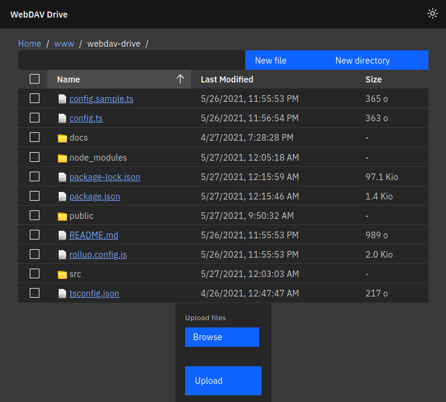

# WebDAV Drive

[![build status][buildimg]][buildurl]

WebDAV front-end that adds a Google-Drive-like experience to an existing WebDAV
share, written in [TypeScript][typescript] with [Svelte][svelte],
[Carbon][carbon] and [perry-mitchell/webdav-client][webdav].



For now, it has to be configured before compilation, [suckless][suckless] style,
so it is not possible to distribute a precompiled bundle.

## Build...

1. Install the dependencies:

    ```bash
    npm install
    ```

2. Copy the sample config file into `config.ts` then edit it:

    ```bash
    cp config.sample.ts config.ts
    ```

### ...for production

To create an optimised version of the app:

```bash
npm run build
```

The `public` directory now contains the fully built production app.

### ...for development

Start the dev server using the following comand, then navigate to
[localhost:5000](http://localhost:5000):

```bash
npm run dev
```

[buildimg]: https://github.com/club-1/webdav-drive/actions/workflows/build.yml/badge.svg
[buildurl]: https://github.com/club-1/webdav-drive/actions/workflows/build.yml?query=branch%3Amain
[typescript]: https://github.com/microsoft/TypeScript
[svelte]: https://svelte.dev
[carbon]: https://github.com/IBM/carbon-components-svelte
[webdav]: https://github.com/perry-mitchell/webdav-client
[suckless]: https://suckless.org/
